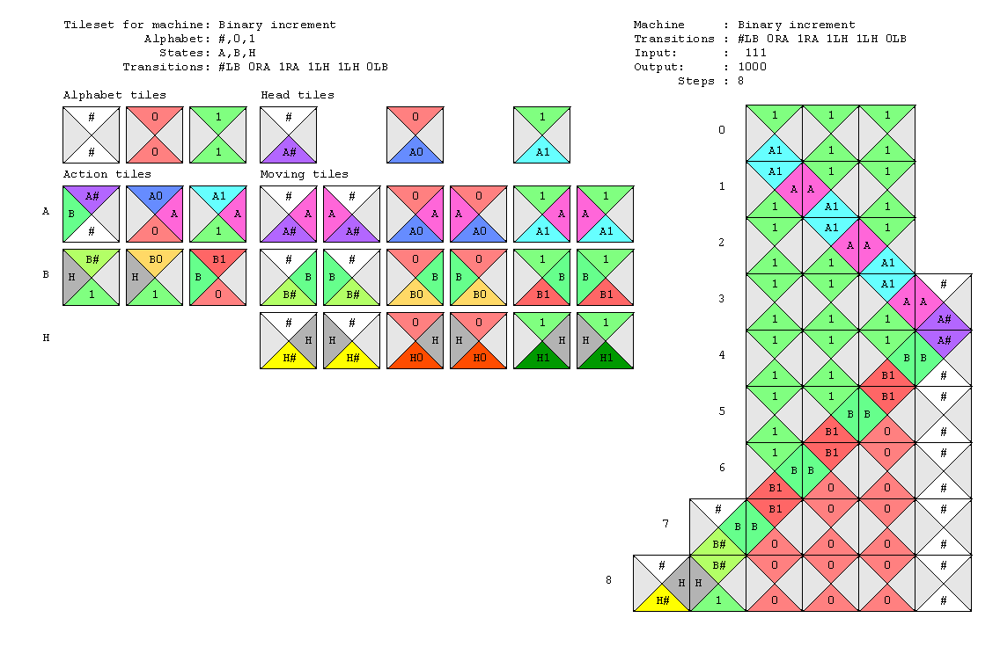

# Wang Tiles Turing Machines

This is the companion source code for my page [Simulating Turing Machines with Wang Tiles](https://seriot.ch/projects/simulating_turing_machines_with_wang_tiles.html).

__Simulating Turing Machines with Wang tiles__

`wtm` (Wang tiles Turing Machine) is a Python program that demonstrates how to perform computation by simulating a Turing machine (TM) with Wang tiles in practice. It is based on the procedure described by Robinson in 1971 in [Undecidability and nonperiodicity for tilings of the plane](https://lipn.fr/~fernique/qc/robinson.pdf).

Here is the tileset for a Turing machine that will increment a number. The input `111` can be read at the top of the tiling, and the result `1000` appears at the bottom.

How does it work? `wtm` generates a specific tileset for each machine. Each tileset encodes the machine alphabet, states and transitions. Each configuration of the machine is simulated with a row of Wang tiles, and each machine step grows the tiling downwards. Tilesets are such that procedurally tiling a new row simulates the execution of the machine.

Some tiles have colors on their south edge that do not appear on any north edge. Consequently, whenever these tiles are used, the tiling cannot continue and the machine halts. The output of the calculation can then be read on the last row.

In summary, `wtm` does:

* encode a Turing machine into a set of Wang tiles
* run the machine for a given input
* draw the tiling that results from the computation

__Source Code__

The source code consists in the following Python files:

* `wtm_model.py` WangTM class, can generate Wang tiles set for any TM configuration, and run the maching for any input
* `wtm_draw.py` methods to draw the tileset and the execution of a WangTM for some given input, using the [Pycairo](https://pycairo.readthedocs.io/) grapic library
* `wtm_machines.py` sample Turing machines as WangTM instances
* `wtm_tests.py` unit tests for the sample machines
* `wtm.py` a sandbox for running and/or drawing WangTM instances 

__Sample usage__

    # define a Turing machine
    tm = WangTM(name="Binary increment",
                states=["A","B","H"],
                alphabet=["0","1"],
                blank_symbol="#",
                transitions_string= "#LB 0RA 1RA 1LH 1LH 0LB")

    # raw run
    step, left_shifts, tape, output = tm.run("1010")

    # raw run with callback at each step
    for step, left_shifts, tape in self.run_gen("1010"):
        pass

	 # run and draw the tiling
    filename = draw_tm(tm, input="1010”)
